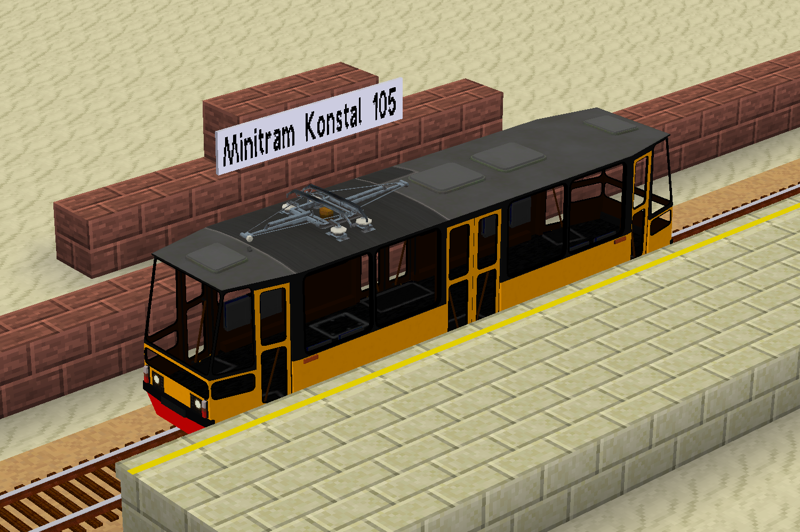

<!--
SPDX-FileCopyrightText: 2022 David Hurka <doxydoxy@mailbox.org>

SPDX-License-Identifier: MIT
-->

# doxy_mini_tram

This mod adds a Minitram Konstal 105 train model to `advtrains`, which is a scaled down variant of the Konstal 105N tram.

## About

On the LinuxForks Minetest server we realized that `advtrains` is missing train models which allow for a panoramic view.
Therefore, it is currently not possible to make scenic railways with appropriate trains.

The Minitram Konstal 105 train model shall fill this gap.
The Konstal 105N is a tram series from eastern europe, which was built in huge numbers, and is now ubiquitous for most tram services in eastern europe.

Relevant for this mod is that it has an angular look, which is suitable for a low poly game like Minetest; and a length of only 13.5m, so it fits well in `advtrains`.
But most important: it has really big windows!
The windows are even bigger than busses use to have, so the nickname “aquarium” is not that bad. ;)

This modpack contains the mod `minitram_konstal_105`, which contains the “Minitram Konstal 105” train model.

## Installation

This mod is intended to be installed from Minetest’s own content manager, [ContentDB](https://content.minetest.net/doxygen_spammer/doxy_mini_tram).

You can also clone the repository to your `mods` folder.
You will need to disable the “LICENSES” and “screenshots” mods, if your Minetest can not figure out that these aren’t mods.

## License

The mod is licensed as CC-BY-SA-4.0 (media) and MIT (code).

Screenshots depict artwork from other Minetest mods, and are licensed as CC-BY-SA-4.0.

## Contributing

The source code is hosted at <https://invent.kde.org/davidhurka/doxy_mini_tram>.
Problems should be reported at <https://invent.kde.org/davidhurka/doxy_mini_tram/issues>.
