<!--
SPDX-FileCopyrightText: 2022 David Hurka <doxydoxy@mailbox.org>

SPDX-License-Identifier: MIT OR CC-BY-SA-4.0
-->

# visual_line_number_displays

This mod gives `advtrains` wagons the ability to show actual line number displays on their objects.
These displays may show just the line number; or the line number, the train’s destination, and extra information.
This is comparable to the line number display feature on the subway wagon from `basic_trains`.

## Display string syntax

The user interfaces with this library by setting the outside display property of `advtrains` trains.
This property uses _display string syntax_, which is described here.

### Display string syntax features

A display string may be just a number, but it may also use these syntax features.

#### Shaped blocks

Sections of text may be enclosed in a _shaped background block_.

There are square (rectangular), round, and diamond shaped block.
A section of text is enclosed in such a block by enclosing it in double brackets.
The outer bracket pair may be replaced to give the block an additional thin outline.

These background shapes are available:

 * `[[Text on square background]]`
 * `((Text on round background))`
 * `<<Text on diamond background>>`
 * `_[Text in square outline]_`
 * `_(Text in round outline)_`
 * `_<Text in diamond outline>_`

It is not possible to nest blocks.

Text which is not enclosed in a bracket pair is called a _shapeless block_.

#### Background patterns

Shaped blocks are usually drawn in the current _background color_.
There is also a _secondary background color_, which is used for _background patterns_.

A background pattern is added to a shaped block by writing a short character sequence directly before the double brackets of the shaped block.

Background patterns can also be used with outlined shaped blocks.
Then the pattern sequence is written before the underscore.

These pattern sequences are available:

 * `-`
 * `/`
 * `|`
 * `\`
 * `-|`
 * `\/`

The lines indicate in which direction the color separation line(s) will go.

Example: `|((Left and right halves))`

The two colors can be swapped by writing the sequence after the block instead of before the block.

Example: `_(Right and left halves)_|`

#### Display sections

A display has up to three sections:

 * _Number_ section, shown on the left.
 * _Text_ section, shown on the right.
 * _Details_ section, shown below the text section in smaller font.

The display string advances to the next section when a semicolon or line break (outside a shaped block) is encountered.

An `advtrains` wagon definition may restrict individual displays to certain sections.
The other sections are then not shown on these displays.
This can be used to simulate the rear display of a bus, which usually shows only the line number but no destination.

Example: With the display string `152; North`, the rear display shows only `152`.

#### Line breaks

As described above, line breaks using the line break character separate different display sections.

To get a line break within a shaped or shapeless block, you can use a double space or an _entity_.

Example: `Two  lines [[and{NewLine}three{nl}lines]]`

#### Text features

Strokes can be applied to any text block by writing a certain character directly before or after the text.
In case of a shaped block, this character goes inside the bracket pair.

These features are available:

 * `/`
 * `|`
 * `\`

The line indicates in which direction the stroke line will go.
In the case of `|`, a horizontal stroke is drawn.
This allows to use `-` as usual text character.

If the character is written before the text, the stroke is drawn in the background.
If it is written after the text, the stoke is drawn on top of the text, possibly obscuring it.

_Text features_ can be used to make “stroked lines”.

Example: `[[/12]]; North; (Express line)`

Text features use the _feature color_.

#### Color brace sequences

There are four colors which can be set individually:

 * Text color (`text`, `t`)
 * Background color (`background`, `b`)
 * Secondary background color (`secondary_background`, `pattern`, `s`, `b2`, `p`)
 * Feature color (`feature`, `f`)

These colors are set automatically when the display string contains a number, using the color algorithm of the `basic_trains` subway wagon.

Using _color brace sequences_, the colors may be set explicitly.
A color brace sequence is the color identifier (from the list above), followed by a colon and a HTML style hexadecimal color; enclosed in a brace pair.
The hexadecimal color consists of a `#` sign, and three or six hexadecimal digits.

Example: `{background:#fff} White Line`

When a color is set explicitly, the other colors are recalculated automatically to ensure some color contrast.

It is possible to reference the background color of a certain line, by using the line identifier in double quotes.

Example: `{background:"1"}{secondary_background:"2"}/((1-2 Combo Line))`

It is possible to use the whole color scheme of another line with the `all` or `a` identifier.
In this case, the line may be identified as string or as integer, which depends on the mod which defined that line.
The builtin subway wagon color schemes are identified as integer.

Example with integer: `{all:1}[[101]]; Shuttle to Line 1`
Example with string: `{a:"S1"}<<S101>>; Shuttle to Line S1`

Color brace sequences may be used inside or outside of shaped blocks.

If they are used inside, the colors are applied only to the whole shaped block.

If they are used outside, the colors are applied to all following blocks and text.
If they are used inside a _shapeless block_, the shapeless block is split.

Example inside shaped block: `{b:#000} [[{b:#0d0}Green square]] (({b:#f00}Red circle))`
Example within shapeless block: `{t:#000} Black text {t:#f00} Red text`

It is possible to “unset” a color which has been set explicitely before.
This is done by not providing any color after the colon.

Example: `[[1]]; White text {t:#f00} Red text {t:} White text`

This causes the color to be calculated automatically.
It is usually safe to do this for the text color.
Line color schemes usually set the background color.
Deleting the background color would cause the whole color scheme to “disappear”, which may affect more colors than you think.

#### Entities

_Entities_ allow to enter characters which are not supported by your keyboard or Minetest’s keyboard handling.
They also allow to escape characters which would otherwise be considered part of the syntax.

Entities are written with their name in a single brace pair.

Example: `{slash}12; This line begins with an actual slash, instead of being stroked.`

These entities are provided:
 * `{`, `}`, `{{`, `}}`: lcurl, rcurl, llcurl, rrcurl
 * `[`, `]`, `[[`, `]]`: lbrak, rbrak, llbrak, rrbrak
 * `(`, `)`, `((`, `))`: lpar, rpar, llpar, rrpar
 * `<`, `>`: lt, gt
 * `|`: bar, vline
 * `-`: dash, minus
 * `/`: slash
 * `\`: backslash, bslash
 * ` `: space, sp
 * Line break: nl, newline
 * `:`: colon
 * `;`: semicolon, sc
 * `=`: equals, equal, eq
 * `"`: quote
 * `#`: hash
 * `_`: underscore, us

In addition the HTML 4 and HTML 5 entities are supported, for those glyphs which are available in `font_metro`.

_Numeric entities_ allow to insert any UTF-8 encoded character, even those not supported by `font_metro` or Unicode.

They are written like HTML numeric entities, as a hash followed by a decimal number, or as `#x` followed by a hexadecimal number.
Like in HTML, the number encodes the codepoint, not the UTF-8 representation.

Example: `Lots of{sp}white{#32}space{#x20}here.`

#### Macros

_Macros_ work similar to entities, as they are replaced with another string.
While entities are parsed as the last step, macros are parsed before everything else,
so macros may contain any other syntax (and even other macros).

Like entities, macros are identified by their name, and are written with the name enclosed in single braces.

Macros may receive an argument if their name ends with `=`.
The argument is written directly after the macro name, and may contain any syntax, including other macros.

Example: `{Warning_Label=33  1202}` may turn into `_[{b:#d80}{t:#000}{f:#000}33  1202|]_`, which will look like the warning label for gasoline.

There are no macros provided by default.
Other mods may register their own macros.

More information is found at the end of this file.

#### Syntax errors

In most cases, syntax errors are passed through until the text is rendered, i. e. invalid syntax will appear as plain text on the final display.

This allows you to see where syntax is invalid.

You can deliberately use invalid syntax to avoid using entities.
Invalid syntax may often be considered “no syntax”, but still it is debatable whether this is good practice.

Example: `(invalid_block))` is not valid block syntax, and will render the same as `{lpar}invalid_entity{rrpar}`.

### Display string syntax examples

This table contains examples of display string syntax, to illustrate the above syntax reference.

The pictures are actual renderings of the generated texture strings, created with a hacked Minetest client.
Here they are upscaled so any device shows them without filtering.

The data in this table is used as unit test.
See the files `autotests/manual_pictures.lua` and `autotests/manual_spec.lua`.

To generate the pictures, you need a Minetest client with the [`save-texture-string-as-png`](https://github.com/doxygen-spammer/minetest/tree/save-texture-string-as-png) branch applied.
The file `autotests/render_manual_pictures.lua` registers the chat command `/render_manual_pictures`, which will send all test displays as texture string to the client.
The client will then render this texture, find a specialized `[save:` texture modifier, and save the texture at the specified location.

<table>
<tr><th>Rendering</th><th>Display string input</th><th>Comments</th></tr>
<tr><td></td><td>

`1`

</td><td>

Plain line numbers may be entered directly, as-is.

</td></tr>
<tr><td></td><td>

`2`

</td><td>

For single-digit decimal line numbers, the background color is taken from the `basic_trains` subway wagon’s color list.

</td></tr>
<tr><td></td><td>

`U3`

</td><td>

Line numbers may contain additional letters, the background color lookup uses only the digits (and optionally a minus sign).

</td></tr>
<tr><td></td><td>

`4a`

</td><td>

Display strings as simple as these will result in a rectangular box, filled with the background color, with the text in the middle.

</td></tr>
<tr><td></td><td>

`[[5]]`

</td><td>

With double square brackets, the text can be enclosed in a rectangular box.
This is called a _shaped block_.

The shaped block takes the color associated with this line.
The display background is slightly shaded to make the box visible.

</td></tr>
<tr><td></td><td>

`((Line)) <<6>>`

</td><td>

Shaped blocks are also available in round and diamond shape.

It is possible to use more than one shaped block.

The left block does not contain digits, and therefore does not affect the line color lookup.

</td></tr>
<tr><td></td><td>

`_[Outlined]_ _(7th)_ _<Line>_`

</td><td>

Shaped blocks are also available in a variant with a thin outline.
The outline uses the text color.

In this example, it is not necessary to shade the display background, because of the outlines.

</td></tr>
<tr><td>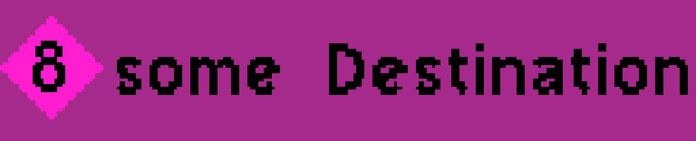</td><td>

`<<8>>; some Destination`

</td><td>

The semicolon advances to the next _display section_.
There are three display sections, called _number_, _text_, and _details_.

Here, the text “some destination” is only shown on displays that have the _text_ section enabled.
Smaller displays may choose to show only the _number_ section.

</td></tr>
<tr><td>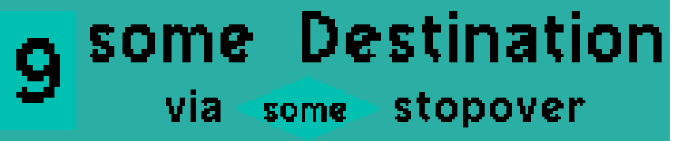</td><td>

`[[9]]↵some Destination↵via <<some>> stopover`

</td><td>

A line break does the same as a semicolon.
(Here it is visualized with `↵`.)

The _details_ section is shown in a smaller font.

There is a diamond shaped block in the details section.

The text spans outside the shaped blocks are called _shapeless blocks_.

Any section may contain any number of blocks.
The texture resolution is increased automatically if necessary.

</td></tr>
<tr><td></td><td>

`10`

</td><td>

For line numbers with more than one digit (or negative numbers), the color hashing algorithm from the `basic_trains` subway wagon is used.

</td></tr>
<tr><td></td><td>

`/11`

</td><td>

Any block may have _features_, which are strokes drawn above or under the text.

A slash before the text draws a stroke from the bottom-left to the top-right under the text.

Such features may be used for “stroked lines”.

</td></tr>
<tr><td></td><td>

`[[\12]]`

</td><td>

In the case of shaped blocks, the feature character is written inside of the double brackets.

</td></tr>
<tr><td></td><td>

`[[|13]]`

</td><td>

For a horizontal stroke, the vertical bar is used.
This allows to use the minus sign as usual, just in case you have negative line numbers.

</td></tr>
<tr><td></td><td>

`[[14/]]; towards A; via B|`

</td><td>

When the feature character comes after the text, the stroke is drawn on top of the text.

</td></tr>
<tr><td></td><td>

`-((15))`

</td><td>

With character sequences outside the double brackets, _background patterns_ can be created.
This works only for shaped blocks.

A minus sign makes a horizontal separation line between the _background color_ and _secondary background color_.

The secondary background color is calculated automatically from the background color, which is calculated from the line number.

</td></tr>
<tr><td></td><td>

`/((16))`

</td><td>

A slash makes a diagonal separation line.

</td></tr>
<tr><td></td><td>

`|((17))`

</td><td>

A vertical bar makes a vertical separation line.

</td></tr>
<tr><td></td><td>

`\((18))`

</td><td>

A backslash makes a diagonal separation line.

</td></tr>
<tr><td></td><td>

`-|((19))`

</td><td>

Minus and vertical bar can be combined, which gives a plus shape.

</td></tr>
<tr><td></td><td>

`\/((20))`

</td><td>

Backslash and slash give an X shape.

</td></tr>
<tr><td></td><td>

`/((21)) ((21))/`

</td><td>

When the background pattern sequence is written after the double brackets, the two colors are swapped.

</td></tr>
<tr><td></td><td>

`|-((22));; ((22))-|`

</td><td>

Of course this works in all display sections...

</td></tr>
<tr><td></td><td>

`|-_(23)_ _[23]_-|`

</td><td>

...and with all background shapes.

</td></tr>
<tr><td>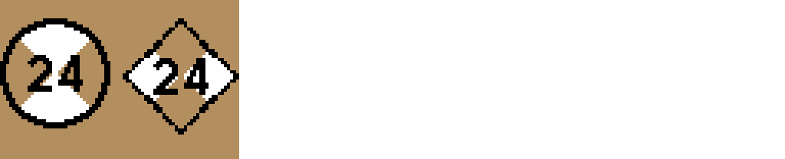</td><td>

`_(24)_\/ \/_<24>_-|`

</td><td>

Here, the second block has both `\/` and `-|` as pattern sequence.
This is considered invalid syntax, and the second sequence is discarded.

</td></tr>
<tr><td>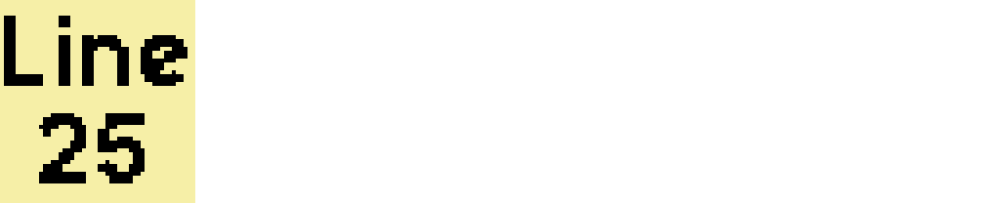</td><td>

`Line  25`

</td><td>

Remember that line breaks cause the display string to advance to the next display section.
With a double space character, a line break can be displayed.

</td></tr>
<tr><td></td><td>

`<<Line  26>>; to  A; via  B`

</td><td>

Line breaks with double spaces also work in shaped blocks and in all display sections.

</td></tr>
<tr><td></td><td>

`<<Line {sp}27>>; to {space}A; via{nl}B`

</td><td>

To enter double spaces, you need to use _entities_.
Entities can also be used for the line break.

</td></tr>
<tr><td></td><td>

`<<Line {}28>>; to {space}A; via{NewLine}B`

</td><td>

Empty entities are considered invalid syntax, and appear as-is.

</td></tr>
<tr><td></td><td>

`_<{underscore}{lt}29{gt}{us}>_`

</td><td>

Entities can be used to escape any character which is relevant for syntax.

</td></tr>
<tr><td></td><td>

`30; K{ouml}ln`

</td><td>

Most HTML 4 entities are supported.

</td></tr>
<tr><td></td><td>

`31; {OpenCurlyDoubleQuote}Island{CloseCurlyDoubleQuote}`

</td><td>

HTML 5 entities are supported where `font_metro` has the relevant glyph.

</td></tr>
<tr><td>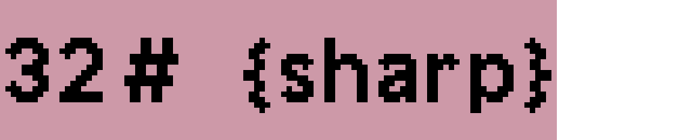</td><td>

`32; {num} {sharp}`

</td><td>

`font_metro` does not have a &sharp; glyph, therefore the entity is passed through as-is.

</td></tr>
<tr><td>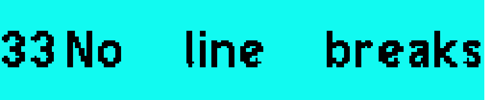</td><td>

`33; No {#32}line{#x20} breaks`

</td><td>

Numeric entities work like in HTML, with the decimal or hexadecimal Unicode codepoint.

If the glyph is not available in `font_metro`, you will see a replacement sign.

Numeric entities may be used to access additional glyphs, which were placed by other mods in the _Private Use Area_ of `font_metro`.

</td></tr>
<tr><td></td><td>

`34; {#08216}Island{#x002019}`

</td><td>

Numeric entities may have leading zeroes.

</td></tr>
<tr><td></td><td>

`<<{background:#ffffff}35>>; {text:#ffaa00}Orange`

</td><td>

_Color brace sequences_ may be used to explicitly set individual colors.

The color needs to be a HTML-like hexadecimal color with 3 or 6 digits.

</td></tr>
<tr><td></td><td>

`<<{b:#000}36>>; {t:#ffaa00}Orange`

</td><td>

Color brace sequences can be identified with short abbreviations.
See the reference section for them.

</td></tr>
<tr><td></td><td>

`<<37>>{b:#00f}; Text`

</td><td>

The last background color of the number section will be used as display background color.

</td></tr>
<tr><td></td><td>

`{b:#00f}<<38>>; Text`

</td><td>

Color brace sequences outside of shaped blocks propagate to all following blocks.

</td></tr>
<tr><td></td><td>

`<<39>>{t:#00f}; Text`

</td><td>

Another example for propagation of the color brace sequence.

</td></tr>
<tr><td></td><td>

`{t:#00f}<<40>>; Text`

</td><td>

Another example for propagation of the color brace sequence.

</td></tr>
<tr><td></td><td>

`{all:1}<<41>>; Text`

</td><td>

With the identifier `all` or `a`, you can apply the whole color scheme of a specific line.

If the line is identified as string, it needs to be given in double quotes.
The builtin lines are identified as integer.

</td></tr>
<tr><td></td><td>

`<<42>>; _[Some]_ {a:1} _[Text]_`

</td><td>

Again, the color scheme is only applied to following blocks.

</td></tr>
<tr><td></td><td>

`<<{b:\"42\"}43>>; {t:\"39\"}Text`

</td><td>

Instead of a hexadecimal color code, a line number can be referenced.
This is always done with double quotes.
Even if the identifier of the color brace sequence is not `background` or `b`, this will always use the background color of the referenced line.
(The background color is considered the primary color of a line color scheme, because it fills most of the display space.)

Here it can be seen that color brace sequences in shaped blocks are applied only to that block.

</td></tr>
<tr><td></td><td>

`[[44]]; {t:#0ff} ((some)) ((text))`

</td><td>

Another example for propagation of the color brace sequence.

</td></tr>
<tr><td></td><td>

`[[45]]; {t:#0ff} ((some)) {t:} ((text))`

</td><td>

If no color is provided in a color brace sequence, the color is no longer explicitly set.
It will be recalculated based on any other explicitly set colors.

This works fine for the text color.
Because line color schemes are usually defined by the background color, deleting the background color usually deletes the whole color scheme.

</td></tr>
<tr><td></td><td>

`-|[[{secondary_background:#000}46]]; -|[[46]]`

</td><td>

An example for automatic recalculation of not explicitly set colors.
The background color is explicitly set by the line number, and the text color is implicitly calculated to give maximum contrast.

For bright green background, the text would be black.
But after setting the secondary background color to black, black text would no longer be readable.

</td></tr>
<tr><td>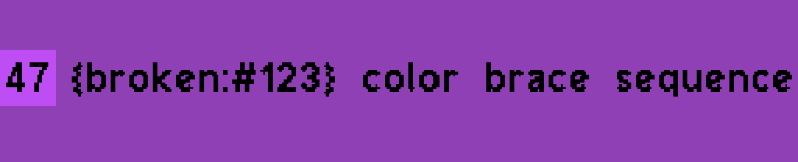</td><td>

`[[47]]; {broken:#123} color brace sequence`

</td><td>

Color brace sequences with invalid identifiers are considered invalid syntax, and are passed through as-is.

</td></tr>
<tr><td>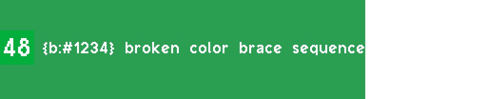</td><td>

`[[48]]; {b:#1234} broken color brace sequence`

</td><td>

Same for invalid color codes.

</td></tr>
<tr><td></td><td>

`[[49]]; [_wrong_] [(blocks)]`

</td><td>

These double bracket pairs are passed through as-is, because no background shape is defined for them.

</td></tr>
<tr><td></td><td>

`[[50]]; (single) [brackets] <work>`

</td><td>

Because shaped blocks use double bracket pairs, you can use single brackets (except braces) just fine.

</td></tr>
<tr><td>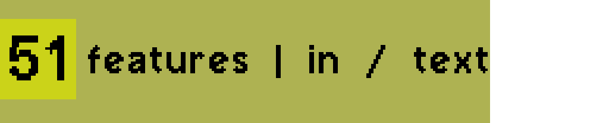</td><td>

`[[51]]; features | in / text`

</td><td>

You can not use text features in the middle of any block.
Features need to span the entire block.

In case of shapeless blocks, it would be possible to use no-op color brace sequnces to split the shapeless block.

</td></tr>
<tr><td></td><td>

`[[52]]; ((No [[nested]] {{blocks}}))`

</td><td>

Shaped blocks can not be nested.

</td></tr>
<tr><td></td><td>

`[[53]]; cut off ((block`

</td><td>

You can (currently) omit the closing bracket pair of the last shaped block.
This is considered invalid syntax.

</td></tr>
<tr><td>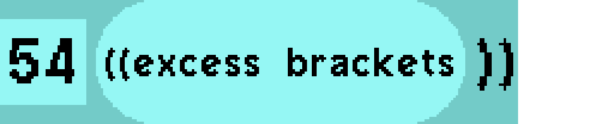</td><td>

`[[54]]; ((((excess brackets))))`

</td><td>

Shaped blocks use the first matching closing bracket pair.

</td></tr>
<tr><td>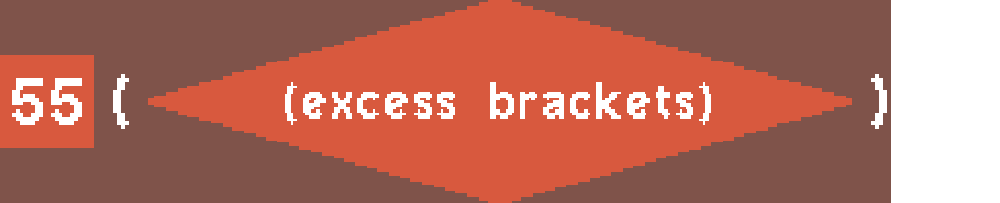</td><td>

`[[55]]; (<<(excess brackets)>>)`

</td><td>

There is no shaped block defined for `(<...>)`, so the shaped block starts with `<<`.

</td></tr>
</table>

## How it works

This mod uses the text rendering feature from `font_api` to create texture strings with visible text.
These texture strings can be applied to a texture slot of an `advtrains` wagon’s entity.
The mesh of the entity is responsible for mapping the texture to an area where the line number display shall appear.

This mod includes a syntax parser for the display string syntax.
The syntax allows to specify not only the displayed text, but also its appearance (color, outline); and it allows macros, which may be defined by other mods.

Because of the complex syntax, it was found that the `line` property of an `advtrains` train should not be used.
Instead, **the `text_outside` property is used**, which allows more complex strings without interfering with automatic train control.

This mod adds the necessary logic to the `advtrains` wagon definition.
The logic includes a `custom_on_step()` function, which polls the `text_outside` property to monitor it for changes.
If the property changes, a new display texture is generated and applied to the wagon entity.

## How to use this library

Read the documentation of the `multi_component_liveries` mod to learn how to make a 3D model with a dedicated texture slot for the line number displays.

This texture needs to be UV mapped, so the individual displays appear at the correct position on the model.
The UV mapping may not include rotation, mirroring, or skewing.
The texture needs to show the display in upright orientation.

Describe the UV mapping with a `display_description` table.
This data type is documented in `api.lua`, and describes where displays shall be rendered on the texture.

Call `visual_line_number_displays.setup_advtrains_wagon()` with the `display_description` table, your `advtrains` wagon definition, and the number of the texture slot.
This function adds the necessary logic to the wagon definition.

### Internals

The core function of this library is `visual_line_number_displays.render_displays()`, which does the full work of converting a display string to a texture string, using a `display_description` table.
This function may later be exposed to the API, so other mods may implement line number displays on other objects.

### Line color schemes

This library ships with the color scheme of the `basic_trains` subway wagon, which includes integer line numbers.
Other mods may define color schemes for specific lines.
These lines may be identified as integer or as string.

To define a color scheme, a mod may add elements to `visual_line_number_displays.line_colors`.
This table is documented in `api.lua`.

### Macros

Instead of just providing initial color schemes for specific lines, other mods may provide _macros_, which may be used arbitrarily in display strings.

Macros expand to strings, which may contain any display string syntax, including other macros (up to the recursion limit).
Macros are identified by their name, which is just a string.
They are invoced with their name enclosed in braces.
Macros may receive an argument if the name ends in `=`.

To define a macro, a mod adds an element to `visual_line_number_displays.macros`.
This table is documented in `api.lua`.

#### Macro examples

Macros may be used to hide display string syntax from the user, or to define corporate designs.

Because the display string is visible in the HUD of the train, this will also result in more human readable HUD information.

For example, the macro `Veaca=` may be defined as follows:

```lua
visual_line_number_displays.macros["Veaca="] = {
    "{background:#7000ba}{text:#fff}(({Veaca_Logo}";
    "))";
};
```

If the display string is `{Veaca={delta}}`, the macro would expand to `{background:#7000ba}{text:#fff}(({Veaca_Logo}{delta}))`.
This display string uses two color brace sequences; another macro, `{Veaca_Logo}`; and the entity `{delta}`.
The macro `{Veaca_Logo}` may be defined to expand to a numeric entity, which references a custom glyph placed in the _Private Use Area_ of `font_metro`.

If the company Veaca once decides to change their corporate color scheme, they only need to update this macro to use other colors.
All trains will use the new color scheme, without the need to change line automation infrastructure.
The same way, Veaca may decide to switch from round to diamond shaped displays, or to define colors individually per line.
